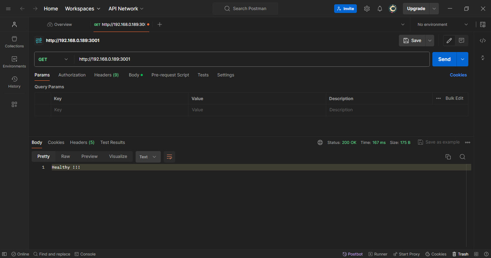

# Hotel Reservation API

Welcome to the Hotel Reservation API, a core component of the final project for the MCDA5550 course at Saint Mary's University. This Spring Boot REST API facilitates hotel listing and reservation creation within its database. Below are the available endpoints along with sample requests and responses.

## Health Checker - GET Request

Use this endpoint to verify the server status.

**GET Request URL**: `https://<your-ip-address>:3001`

**Sample Response**: 
Healthy !!!



## Get Hotels List - GET Request

Retrieve a list of hotels, each accompanied by its ID, name, price, and availability status.

**URL**: `https://<your-ip-address>:3001/get_hotels`

**Sample Response (excerpt)**:
```json
[
    {
        "id": 1,
        "name": "Westin",
        "price": 486.39,
        "availability": true
    },
    {
        "id": 2,
        "name": "Radisson Blu",
        "price": 61.02,
        "availability": true
    }
]
```

## POST Request - create a reservation

This request is used to create a reservation in the database which populates corresponding tables in the database and returns confirmation number as JSON object.

**URL** - `https://<your-ip-address>:3001/create_reservation`

**Sample Body**: 
```json
{
  "hotelName": "InterContinental",
  "checkInDate": "2024-04-15",
  "checkOutDate": "2024-04-20",
  "guestsList": [
    {
      "name": "John Doe",
      "email": "john.doe@example.com",
      "gender": "Male",
      "age": 30
    },
    {
      "name": "Jane Smith",
      "email": "jane.smith@example.com",
      "gender": "Female",
      "age": 25
    }
  ]
}
```

**Sample Response**: 
```json
{
    "confirmationNumber": "R5G0-240413212940"
}
```

## How to Install Application

# Prerequisites
1. Java Development Kit (JDK) installed on your machine.
2. Apache Maven build tool installed on your machine.
3. Visual Studio Code or IntelliJ IDEA installed on your machine.
4. Java Extension Pack installed in Visual Studio Code (optional).

## Instructions for cloning and running the Spring Boot application in Visual Studio Code
1. Open Visual Studio Code.
2. Open a terminal in Visual Studio Code.
3. Run the following command to clone the repository: 
```bash
git clone https://github.com/A00431008/MCDA5550_HotelReservationAPI.git
```
4. Navigate to the root directory of the project in the terminal.
5. Ensure you have the Java Extension Pack installed (optional).
6. Navigate to the main Spring Boot application file (usually named `Application.java` or similar) in the `src/main/java` directory.
7. Right-click on the file and select "Run" or use the shortcut (usually Ctrl + F5) to run the application.

## Instructions for cloning and running the Spring Boot application in IntelliJ IDEA
1. Open IntelliJ IDEA.
2. Open a terminal in IntelliJ IDEA.
3. Run the following command to clone the repository: 
```bash
git clone https://github.com/A00431008/MCDA5550_HotelReservationAPI.git
```
4. Open the root directory of the project in IntelliJ IDEA.
5. Ensure the project is recognized as a Maven project.
6. Navigate to the main Spring Boot application file (usually named `Application.java` or similar) in the `src/main/java` directory.
7. Right-click on the file and select "Run <ApplicationName>" or use the shortcut (usually Shift + F10) to run the application.